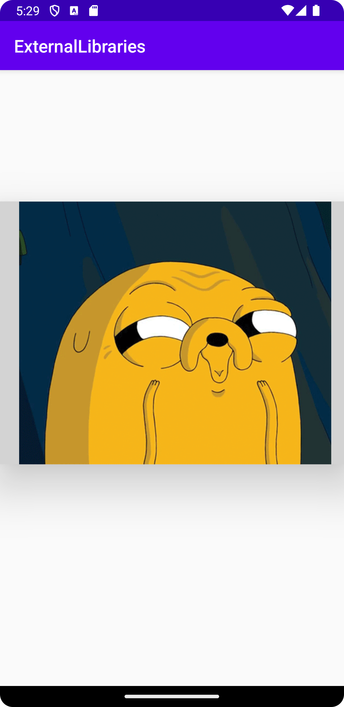

# Rapport
Det som har gjorts i denna uppgift är att addera en ny extern bibliotek genom att lägga till den som en implementation i build gradle module app.
I Manifest lägger en package som för den externa biblioteket. Sedan är det bara att skapa en view som kommer från den externa biblioteket. 
Den externa biblioteket hanterar gif-bilder, så en gif-bild laddades ner och importerades in till drawable, sedan användes den som en src i view:en 
i activity_main.xml.

```
    <pl.droidsonroids.gif.GifImageView
        android:layout_width="400dp"
        android:layout_height="300dp"
        android:src="@drawable/jake_adventure_time"
        android:translationY="150dp"
        android:elevation="30dp"
        android:background="#d3d3d3"/>
        
        <manifest xmlns:android="http://schemas.android.com/apk/res/android"
    package="com.example.externallibraries">


    implementation 'pl.droidsonroids.gif:android-gif-drawable:1.2.23'
```



